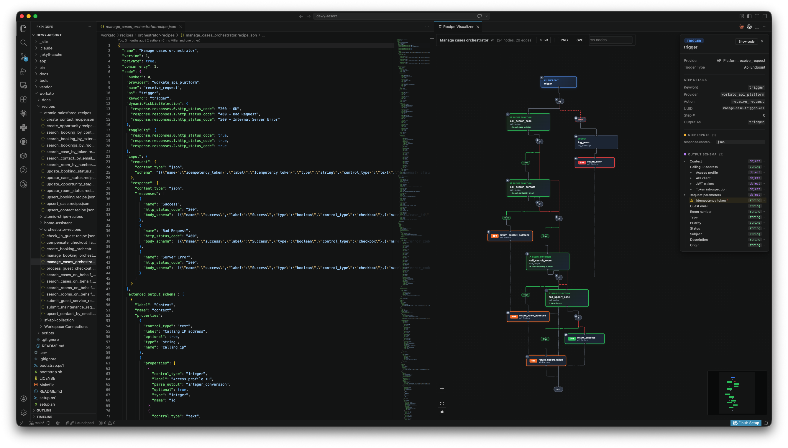

# Recipe Visualizer

A VS Code extension that turns [Workato](https://www.workato.com/) recipe JSON into interactive workflow graphs. See your automation logic as a visual DAG — with click-to-inspect nodes, editor navigation, and support for complex control flow.

Works in **VS Code**, **Cursor**, **Windsurf**, and any VS Code fork.

<p align="center">
  
</p>

## Features

- **Visual workflow graphs** — Nested recipe JSON rendered as clean, directed graphs with orthogonal edge routing
- **Full control flow** — `if/else`, `try/catch`, `foreach` loops, and cross-recipe calls all visualized with swim lane layout
- **Click-to-inspect** — Select any node to see its metadata, input/output schemas, connection info, and step inputs
- **Editor navigation** — "Go to Code" jumps from a graph node to the exact line in your JSON editor
- **Cursor sync** — Moving your cursor in the editor highlights the corresponding node in the graph
- **Layout toggle** — Switch between left-to-right and top-to-bottom layout directions
- **Cross-recipe drill-down** — `call_recipe` nodes open the target recipe in a new visualizer panel

<p align="center">
  
</p>

## Installation

```bash
code --install-extension releases/recipe-visualizer-<version>.vsix
```

Replace `code` with `cursor` or `windsurf` as needed.

## Usage

1. Open a `.recipe.json` file
2. Click the **preview icon** in the editor title bar
3. Or press **Cmd+Shift+V** (Mac) / **Ctrl+Shift+V** (Windows/Linux)
4. Or right-click the file → **"Visualize Recipe"**

| Interaction | What happens |
|---|---|
| Click a node | Opens details panel with schemas, metadata, step inputs |
| Click "→ Code" | Navigates to the source JSON and focuses the editor |
| Click L-R / T-B | Toggles layout direction |
| Move cursor in editor | Highlights the corresponding graph node |

## Development

See [`src/README.md`](src/README.md) for build commands, architecture, project structure, and development workflow.

## Contributing

Contributions are welcome! Please open an issue to discuss your idea before submitting a PR.

## License

[MIT](LICENSE.md)
